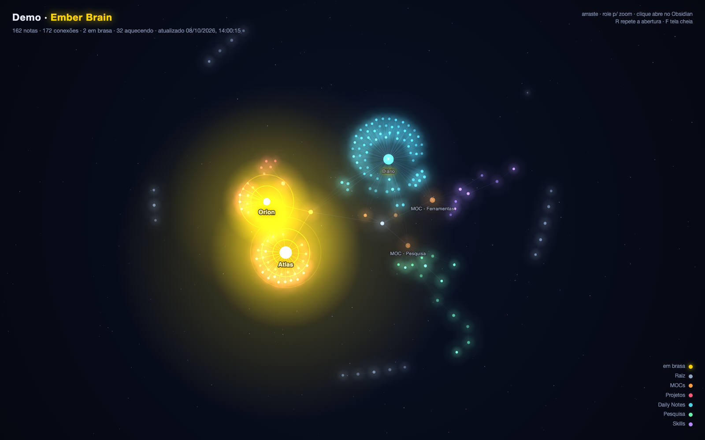

# Obsidian Heatmap · Ember Brain

Mostra **quais notas do seu vault Obsidian estão recebendo mais atualizações**: grava um mapa de calor nas próprias notas (para colorir o grafo nativo) e gera uma página animada do vault, feita para mostrar para outras pessoas.



São duas partes:

1. **`heatmap.py`** grava `heat: hot | warm | cold` no frontmatter de cada nota e exporta o grafo para a página.
2. **`show/index.html`** (Ember Brain) desenha o vault como uma constelação animada:
   - **Abertura:** as notas nascem na ordem em que foram criadas, com uma data correndo no canto.
   - **Notas em brasa:** pulsam em amarelo, com ondas de sonar.
   - **Partículas:** correm pelas conexões em direção às notas mais quentes.
   - **Cores:** cada pasta tem a sua; ao clicar numa nota, ela abre no Obsidian.

Funciona só com Python 3 (sem dependências) e um navegador. A página carrega o [d3](https://d3js.org) por CDN.

## Experimentar sem tocar no seu vault

Abra `show/index.html?demo` no navegador. A página usa um vault fictício (`show/demo-data.js`, gerado por `scripts/make_demo.py`).

## Usar com o seu vault

```sh
cp config.example.json config.local.json   # ajuste os caminhos
python3 heatmap.py --dry-run               # mostra o que faria, sem gravar
python3 heatmap.py                         # grava heat: nas notas e gera show/graph-data.js
open show/index.html
```

`config.local.json`:

| Chave | O que é |
|---|---|
| `vault` | Pasta com as notas a analisar. Pode ser o vault inteiro ou uma subpasta dele. |
| `obsidian_root` | Raiz do vault aberto no Obsidian. Só é diferente de `vault` quando você analisa uma subpasta, e serve para montar os links `obsidian://`. |

Também dá para passar tudo por argumento: `heatmap.py --vault PASTA [--obsidian-root PASTA] [--dry-run]`.

> **Atenção:** o script edita o frontmatter de **todas** as notas `.md` da pasta (acrescenta ou atualiza a linha `heat:`). Faça um backup do vault antes da primeira execução.

## Como o calor é calculado

- **Histórico:** a cada execução, se a data de modificação de uma nota mudou desde a última vez, isso conta como uma atualização. O histórico fica em `heat-state.json`.
- **`own`:** soma de `e^(-dias/7)` de cada atualização dos últimos 60 dias. O peso cai pela metade a cada ~5 dias.
- **`score`:** `own` + 0,25 × soma do `own` das notas ligadas a ela, em qualquer direção. Assim, uma nota central esquenta quando as notas ligadas a ela são atualizadas: uma página de projeto fica quente quando chegam notas de release.
- **Classificação:** `hot` com score ≥ 2, `warm` com score ≥ 0,5, `cold` para o resto. Os limites ficam no topo de `heatmap.py`.

Ao gravar o `heat`, o script **restaura a data de modificação original** da nota. Por isso a escrita dele mesmo não conta como atualização. Rodar duas vezes seguidas não altera nada.

## Cores no grafo nativo do Obsidian

Em *Graph view → Groups*, crie grupos com estas buscas:

| Busca | Sugestão de cor |
|---|---|
| `[heat:hot]` | amarelo `#FFD400` |
| `[heat:warm]` | laranja `#F5A524` |
| `[heat:cold]` | azul-acinzentado `#5B7A99` |

O primeiro grupo que casa com a nota define a cor dela. Se você já colore o grafo por pasta, coloque só `[heat:hot]` no topo: as notas em brasa se destacam e o resto mantém as cores de pasta.

Para mexer no tamanho dos nós do grafo nativo, o plugin da comunidade [Extended Graph](https://github.com/ElsaTam/obsidian-extended-graph) permite dimensionar os nós por data de modificação (`modifiedTime`) ou número de links.

## A página animada

| Ação | Efeito |
|---|---|
| arrastar / rolar | mover / zoom (desliga a câmera automática) |
| passar o mouse | nome, caminho, conexões e calor da nota |
| clicar | abre a nota no Obsidian |
| `R` | repete a abertura |
| `F` | tela cheia |
| `?skip` | abre direto no cérebro pronto, sem a abertura |
| `?demo` | usa os dados de demonstração |

Com a página aberta, ela recarrega `graph-data.js` a cada 10 minutos sem perder as posições. Combinada com o agendamento abaixo, fica "ao vivo".

## Rodar sozinho (macOS)

```sh
scripts/install-launchd.sh        # de hora em hora; passe outro intervalo em segundos se quiser
```

O instalador cria um LaunchAgent (`~/Library/LaunchAgents/com.<usuário>.obsidian-heatmap.plist`) que roda o script a cada hora e no login, com log em `heatmap.log`. O comando para remover é impresso no topo do script.

Se o vault estiver em `~/Documents`, o macOS pode pedir permissão de acesso à pasta na primeira execução.

## Arquivos

| Caminho | Versionado? | O que é |
|---|---|---|
| `heatmap.py` | sim | calcula o calor, grava o frontmatter e exporta o grafo |
| `show/index.html` | sim | a página animada |
| `show/demo-data.js` | sim | dados fictícios para `?demo` |
| `scripts/make_demo.py` | sim | gera `demo-data.js` |
| `scripts/install-launchd.sh` | sim | instala o agendamento no macOS |
| `config.local.json` | **não** | seus caminhos |
| `heat-state.json`, `heatmap.log` | **não** | histórico e log |
| `show/graph-data.js` | **não** | o grafo do **seu** vault (nomes das notas) |

## Licença

MIT
